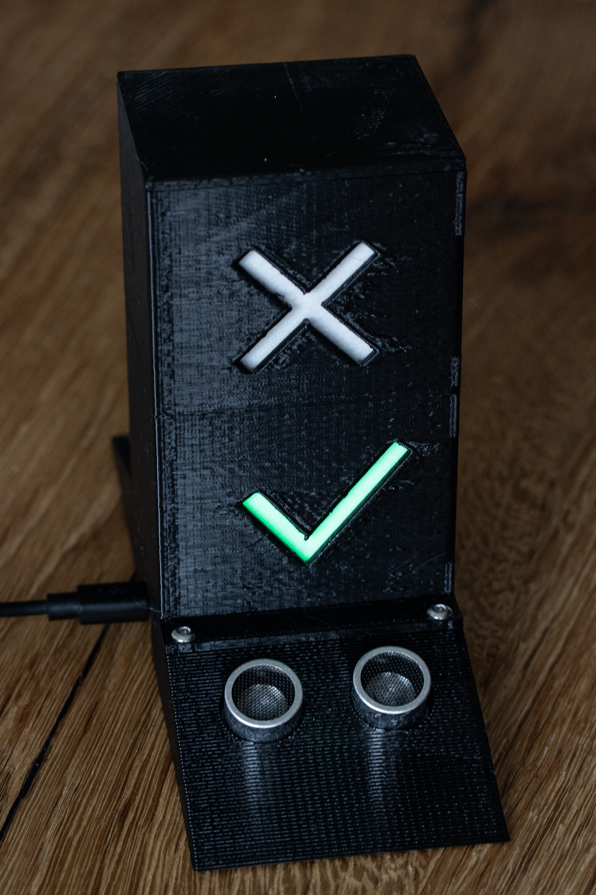
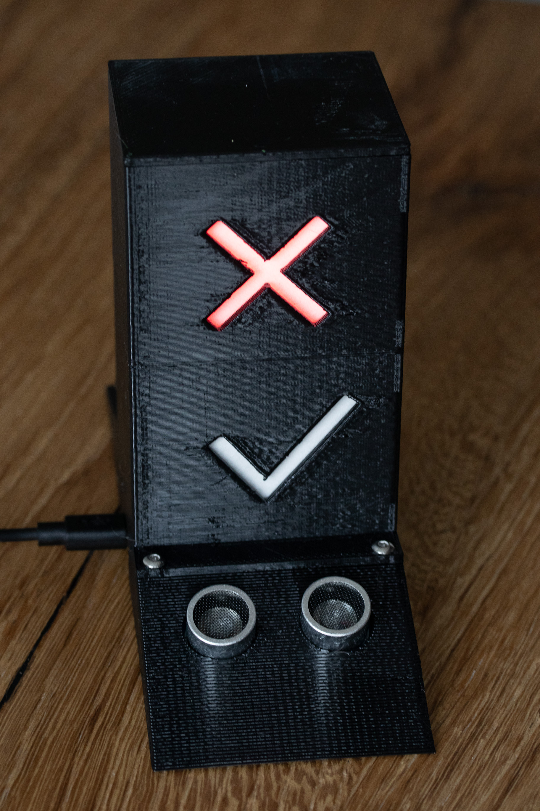
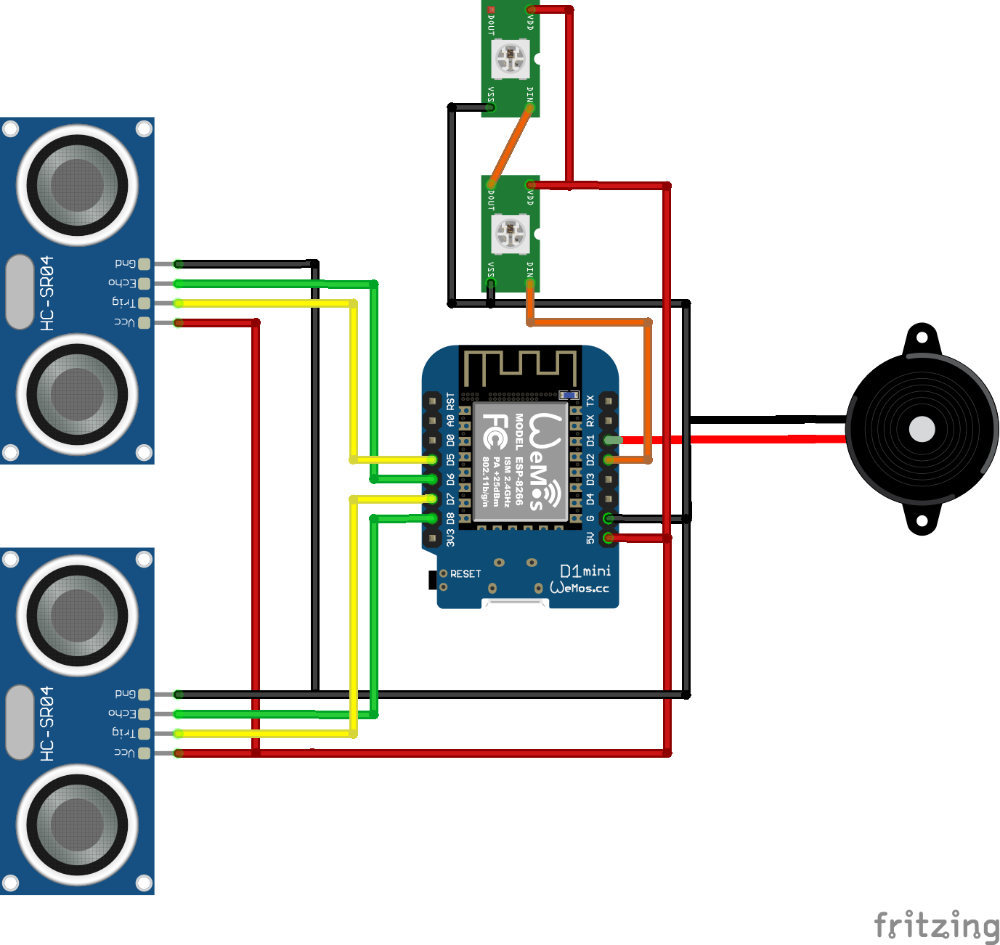

# Touch free people counter

Space available            |  Full
:-------------------------:|:-------------------------:
  |  

## Why does this device exist?
Due to the Corona crisis and measures taken by the state, only a certain number of people are allowed to stay in a shop at the same time in Switzerland. This can be difficult for smaller shops to control. Some shops solved the problem by distributing cards to customers entering the shop but these have to be desinfected after each customer which creates a possible infection hazard and needs work.

## What is it?
This is a small device that shops could use to count people entering and leaving the shop without the need to touch anything. It indicates when to many people are in the shop. The maximum number can be configured using browser on a smartphone.

## Bill of material (BOM)
* 1x WeMos D1 mini
* 2x HC-RS04
* 1x WS2812b LED strip or Green and Red LEDs
* 1x Piezo Buzzer
* 3D prints of the models under [/models](models)
* 4x M3x14mm screws

## Wiring

## Usage

